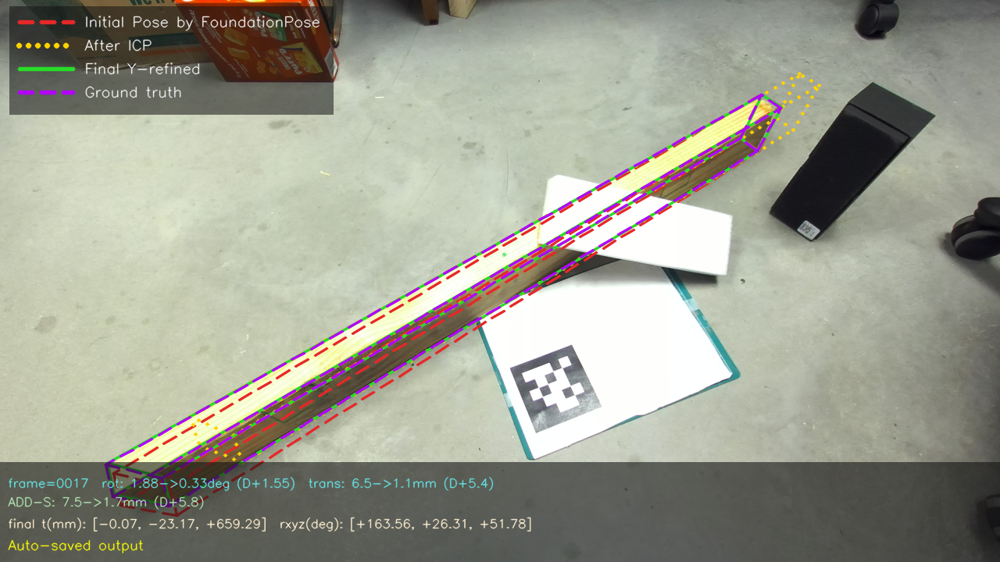
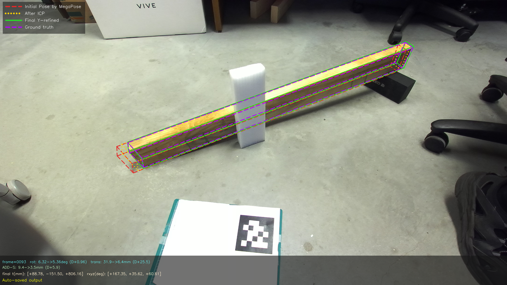
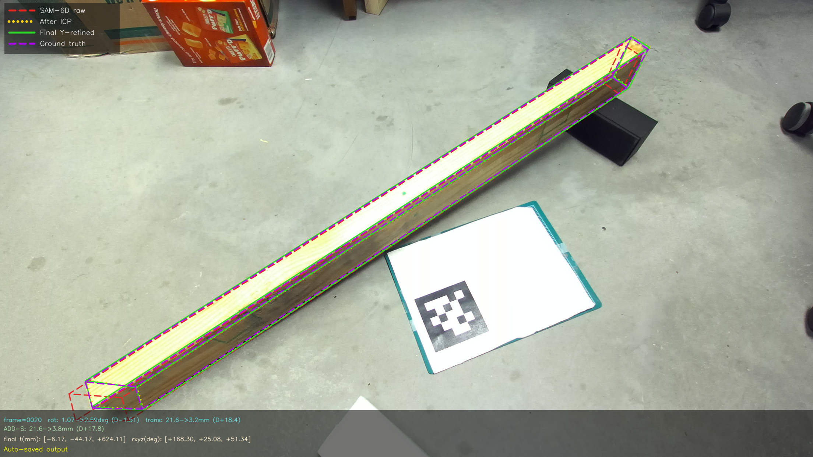

# PoseBoost

Official repository for the results and supplementary materials of our paper on pose refinement with PoseBoost.

This repository releases processed inputs, ground-truth annotations, baseline predictions, PoseBoost-refined poses, and qualitative visualizations built on top of [WFCDataset](https://github.com/yigediao/wfcdataset).

## Overview

We use [WFCDataset](https://github.com/yigediao/wfcdataset) to benchmark PoseBoost for 6D pose refinement in robotic wood-frame assembly. This repository releases the processed data and pose estimation results used for our benchmark, including:

- object masks for each sample
- raw RGB-D inputs
- FoundationStereo-enhanced RGB-D inputs
- ground-truth pose annotations and projected visualizations
- baseline predictions from FoundationPose, MegaPose, and SAM6D
- PoseBoost-refined results and qualitative visualizations

## Qualitative Examples

The following examples show one sample from each baseline pipeline after PoseBoost refinement.

### FoundationPose + PoseBoost



### MegaPose + PoseBoost



### SAM6D + PoseBoost



## Real Robot Validation

### System Overview and Real Wood-Stud Assembly Experiment

<a href="https://youtu.be/vjXvbbGfvfg?si=DoN4wz0cjzn_Gfxv">
  
</a>

### PoseBoost Real-World Robotic Assembly Experiment

<a href="https://youtu.be/sdJ511sR-bw?si=95T8LXwOJ9pCQnhQ">
  
</a>

This video documents randomized single-stud grasping and fixed-target placement trials for validating our computer vision-based robotic wood-frame assembly system. In each trial, a 2x4 wood stud is randomly placed within the robot camera's field of view under cluttered workspace conditions, partial visibility, and varying illumination.

The system uses RGB-D perception and geometry-consistent 6D pose estimation to identify the target stud, refine its pose, update the digital twin, plan a collision-aware robotic trajectory, and execute grasping, transportation, and placement at a predefined target location.

## Data Download

The processed benchmark data and pose estimation results are hosted on Dropbox:

- Dropbox: [Download data here](https://www.dropbox.com/scl/fo/8mdbkkmxnvo2t2g6otrw0/ABD_AegQyW5RdAqws0z1jWs?rlkey=wer3h9d84qpr4vmqupzyrmlfc&st=uwyaljxc&dl=0)

Please download the released files and extract any zip archives under the repository root. The extracted data follows the structure below.

## Data Structure

```text
poseboost/
  README.md
  browse_pose_images.py
  masks/
    0000/
      mask.png
    ...
  raw_rgbd_data/
    0000/
      0000_left.png
      0000_right.png
      0000_depth.png
      0000_cloud.ply
      K.txt
    ...
  rgbd_foundationstereo/
    0000/
      color.png
      depth.png
      K.txt
    ...
  ground_truth/
    0000/
      0000_gt_pose.txt
      0000_gt_projected_rgb.png
      0000_gt_vertices.txt
    ...
  ground_truth.zip
  Baseline/
    foundationpose_pose_result.zip
    megapose_pose_result.zip
    SAM6D_pose_result.zip
  PoseBoost/
    foundationpose+poseboost/
      0000/
        ob_in_cam/
        pose_vis/
      ...
    megapose+poseboost/
      0000/
        ob_in_cam/
        pose_vis/
      ...
    sam6d+poseboost/
      0000/
        ob_in_cam/
        pose_vis/
      ...
```

## Directory Description

- `masks.zip`: per-sample segmentation masks
- `raw_rgbd_data.zip`: original stereo RGB-D observations and point clouds
- `rgbd_foundationstereo.zip`: RGB-D observations enhanced by FoundationStereo
- `ground_truth.zip`: ground-truth poses, projected visualizations, and vertices
- `Baseline/foundationpose_pose_result.zip`: native FoundationPose results
- `Baseline/megapose_pose_result.zip`: native MegaPose results
- `Baseline/SAM6D_pose_result.zip`: native SAM6D results
- `PoseBoost/foundationpose+poseboost/`: FoundationPose results refined by PoseBoost
- `PoseBoost/megapose+poseboost/`: MegaPose results refined by PoseBoost
- `PoseBoost/sam6d+poseboost/`: SAM6D results refined by PoseBoost

The released inputs and ground truth contain 288 samples. The FoundationPose and SAM6D PoseBoost results contain 288 samples, and the MegaPose PoseBoost results contain 243 samples.

## Per-sample File Format

Each sample ID such as `0000` is organized as:

```text
masks/0000/
  mask.png

raw_rgbd_data/0000/
  0000_left.png
  0000_right.png
  0000_depth.png
  0000_cloud.ply
  K.txt

rgbd_foundationstereo/0000/
  color.png
  depth.png
  K.txt

ground_truth/0000/
  0000_gt_pose.txt
  0000_gt_projected_rgb.png
  0000_gt_vertices.txt
```

Each PoseBoost result folder contains:

```text
PoseBoost/<method>/0000/
  ob_in_cam/
    0000_<method>_raw_pose.txt
    0000_icp_pose.txt
    0000_final_y_refined_pose.txt
    0000_bench_result.txt
  pose_vis/
    frame_0000.png
    frame_0000_three_stage_wireframes.png
```

For `foundationpose+poseboost`, the raw prediction file is `0000_foundationpose_raw_pose.txt`.  
For `megapose+poseboost`, the raw prediction file is `0000_megapose_raw_pose.txt`.  
For `sam6d+poseboost`, the raw prediction file is `0000_sam6d_raw_pose.txt`.

## Relation to WFCDataset

This repository is derived from [WFCDataset](https://github.com/yigediao/wfcdataset), which provides the original dataset foundation for this study. The present repository focuses on releasing:

- processed observations used in the paper
- enhanced RGB-D data
- segmentation masks
- baseline predictions
- PoseBoost refinement results

Please refer to the original [WFCDataset](https://github.com/yigediao/wfcdataset) repository for dataset background and core data definition.

## Citation

If you find this repository useful, please cite both our paper and WFCDataset.

```bibtex
@article{poseboost_2026,
  title   = {TODO},
  author  = {TODO},
  journal = {TODO},
  year    = {2026}
}
```

## Acknowledgments

This project builds on the following prior work:

- [WFCDataset](https://github.com/yigediao/wfcdataset)
- FoundationStereo
- FoundationPose
- MegaPose
- SAM6D
